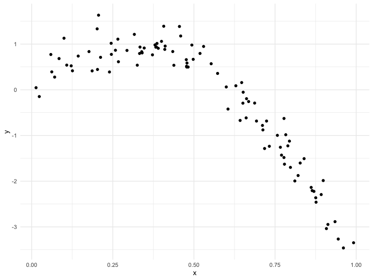
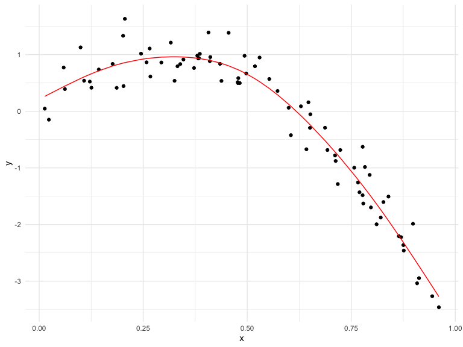
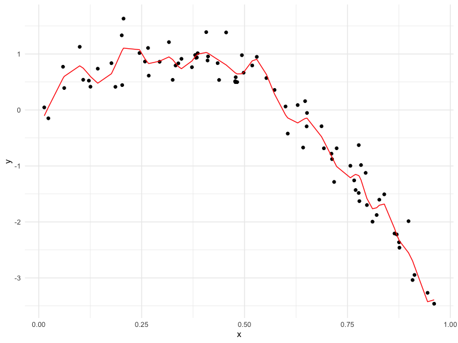

Cross Validation
================
Elaine Yanxi Chen
2022-12-01

## Packages and settings

First we load the packages necessary to knit this document.

``` r
library(tidyverse)
library(mgcv)
library(modelr)
library(viridis)

knitr::opts_chunk$set(
    echo = TRUE,
    warning = FALSE,
    fig.width = 8, 
  fig.height = 6,
  out.width = "90%"
)

theme_set(theme_minimal() + theme(legend.position = "bottom"))

options(
  ggplot2.continuous.colour = "viridis",
  ggplot2.continuous.fill = "viridis"
)

scale_colour_discrete = scale_colour_viridis_d
scale_fill_discrete = scale_fill_viridis_d
```

## Step one

Cross validation “by hand” on simulated data.

``` r
nonlin_df = 
  tibble(
    id = 1:100,
    x = runif(100, 0, 1),
    y = 1 - 10 * (x - 0.3) ^ 2 + rnorm(100, 0, 0.3)
  )

nonlin_df %>% 
  ggplot(aes(x = x, y = y)) +
  geom_point()
```



Let’s get this by hand.

``` r
train_df = sample_n(nonlin_df, 80)
test_df = anti_join(nonlin_df, train_df, by = "id")
```

``` r
train_df %>% 
  ggplot(aes(x = x, y = y)) +
  geom_point() +
  geom_point(data = test_df, colour = "red")
```


Let’s try to fit three models.

``` r
linear_mod = lm(y ~ x, data = train_df)
smooth_mod = mgcv::gam(y ~ s(x), data = train_df)
wiggly_mod = mgcv::gam(y ~ s(x, k = 30), sp = 10e-6, data = train_df)
```

Let’s see the results.

``` r
train_df %>% 
  add_predictions(linear_mod) %>% 
  ggplot(aes(x = x, y = y)) +
  geom_point() +
  geom_line(aes(y = pred), colour = "red")
```


``` r
train_df %>% 
  add_predictions(smooth_mod) %>% 
  ggplot(aes(x = x, y = y)) +
  geom_point() +
  geom_line(aes(y = pred), colour = "red")
```



``` r
train_df %>% 
  add_predictions(wiggly_mod) %>% 
  ggplot(aes(x = x, y = y)) +
  geom_point() +
  geom_line(aes(y = pred), colour = "red")
```



Let’s make predictions and compute RMSEs.

``` r
test_df %>% add_predictions(linear_mod)
```

    ## # A tibble: 20 × 4
    ##       id      x       y     pred
    ##    <int>  <dbl>   <dbl>    <dbl>
    ##  1     1 0.336   0.373   0.299  
    ##  2     8 0.631  -0.0400 -0.902  
    ##  3    10 0.831  -1.52   -1.72   
    ##  4    11 0.671   0.0129 -1.07   
    ##  5    14 0.104   1.08    1.24   
    ##  6    16 0.993  -4.01   -2.38   
    ##  7    17 0.916  -2.98   -2.07   
    ##  8    19 0.737  -0.587  -1.34   
    ##  9    21 0.694  -0.905  -1.16   
    ## 10    25 0.398   0.534   0.0436 
    ## 11    29 0.601   0.269  -0.780  
    ## 12    38 0.823  -1.40   -1.69   
    ## 13    41 0.631  -0.522  -0.903  
    ## 14    52 0.555   0.671  -0.593  
    ## 15    54 0.413   0.769  -0.0159 
    ## 16    60 0.822  -1.53   -1.68   
    ## 17    72 0.0547  0.743   1.44   
    ## 18    88 0.407   1.46    0.00651
    ## 19    90 0.597   0.105  -0.764  
    ## 20    91 0.254   0.992   0.632

``` r
rmse(linear_mod, test_df)
```

    ## [1] 0.8193661

``` r
rmse(smooth_mod, test_df)
```

    ## [1] 0.3241096

``` r
rmse(wiggly_mod, test_df)
```

    ## [1] 0.3829915

## Can we iterate…?

``` r
cv_df = 
  crossv_mc(nonlin_df, 100)

cv_df %>% pull(train) %>% .[[1]] %>% as_tibble()
```

    ## # A tibble: 79 × 3
    ##       id     x       y
    ##    <int> <dbl>   <dbl>
    ##  1     3 0.324  0.747 
    ##  2     4 0.204  0.539 
    ##  3     5 0.265  0.759 
    ##  4     7 0.670 -0.161 
    ##  5     8 0.631 -0.0400
    ##  6     9 0.816 -1.42  
    ##  7    10 0.831 -1.52  
    ##  8    11 0.671  0.0129
    ##  9    12 0.673 -0.441 
    ## 10    13 0.107  0.620 
    ## # … with 69 more rows

``` r
cv_df = 
  crossv_mc(nonlin_df, 100) %>% 
  mutate(
    train = map(train, as_tibble),
    test = map(test, as_tibble),
  ) %>% 
  mutate(
    linear_fits = map(.x = train, ~lm(y ~ x, data = .x)),
    smooth_fits = map(.x = train, ~mgcv::gam(y ~ s(x), data = .x)),
    wiggly_fits = map(.x = train, ~mgcv::gam(y ~ s(x, k = 30), sp = 10e-6, data = .x))
  ) %>% 
  mutate(
    rmse_linear = map2_dbl(linear_fits, test, ~rmse(model = .x, data = .y)),
    rmse_smooth = map2_dbl(smooth_fits, test, ~rmse(model = .x, data = .y)),
    rmse_wiggly = map2_dbl(wiggly_fits, test, ~rmse(model = .x, data = .y)),
  )
```

Make a box plot…

``` r
cv_df %>% 
  select(starts_with("rmse")) %>% 
  pivot_longer(
    everything(),
    names_to = "model",
    values_to = "rmse",
    names_prefix = "rmse_"
  ) %>% 
  ggplot(aes(x = model, y = rmse)) +
  geom_boxplot()
```


## Try it on a real dataset

``` r
growth_df = read_csv("data/nepalese_children.csv")
```

    ## Rows: 2705 Columns: 5
    ## ── Column specification ────────────────────────────────────────────────────────
    ## Delimiter: ","
    ## dbl (5): age, sex, weight, height, armc
    ## 
    ## ℹ Use `spec()` to retrieve the full column specification for this data.
    ## ℹ Specify the column types or set `show_col_types = FALSE` to quiet this message.

``` r
growth_df %>% 
  ggplot(aes(x = weight, y = armc)) +
  geom_point(alpha = 0.3)
```


Brief aside on piecewise linear models.

``` r
growth_df =
  growth_df %>% 
  mutate(
    weight_pwl = (weight > 7) * (weight - 7)
  )
```

``` r
linear_model = lm(armc ~ weight, data = growth_df)
pwl_model = lm(armc ~ weight + weight_pwl, data = growth_df)
smooth_model = mgcv::gam(armc ~ s(weight), data = growth_df)
```

``` r
growth_df %>% 
  add_predictions(pwl_model) %>% 
  ggplot(aes(x = weight, y = armc)) +
  geom_point(alpha = 0.3) +
  geom_line(aes(y = pred), colour = "red")
```


``` r
growth_df %>% 
  add_predictions(linear_model) %>% 
  ggplot(aes(x = weight, y = armc)) +
  geom_point(alpha = 0.3) +
  geom_line(aes(y = pred), colour = "red")
```


``` r
growth_df %>% 
  add_predictions(smooth_model) %>% 
  ggplot(aes(x = weight, y = armc)) +
  geom_point(alpha = 0.3) +
  geom_line(aes(y = pred), colour = "red")
```


``` r
cv_df = 
  crossv_mc(growth_df, 100) %>% 
  mutate(
    train = map(train, as_tibble),
    test = map(test, as_tibble),
  )

cv_df = 
  cv_df %>% 
  mutate(
    linear_fits = map(.x = train, ~lm(armc ~ weight, data = .x)),
    pwl_fits =    map(.x = train, ~lm(armc ~ weight + weight_pwl, data = .x)),
    smooth_fits = map(.x = train, ~mgcv::gam(armc ~ s(weight), data = .x))
  ) %>% 
  mutate(
    rmse_linear = map2_dbl(.x = linear_fits, .y = test, ~rmse(model = .x, data = .y)),
    rmse_pwl =    map2_dbl(.x = pwl_fits, .y = test, ~rmse(model = .x, data = .y)),
    rmse_smooth = map2_dbl(.x = smooth_fits, .y = test, ~rmse(model = .x, data = .y))
  )
```

Let’s look at the results…

``` r
cv_df %>% 
  select(starts_with("rmse")) %>% 
  pivot_longer(
    everything(),
    names_to = "model",
    values_to = "rmse",
    names_prefix = "rmse_"
  ) %>% 
  ggplot(aes(x = model, y = rmse)) +
  geom_boxplot()
```


