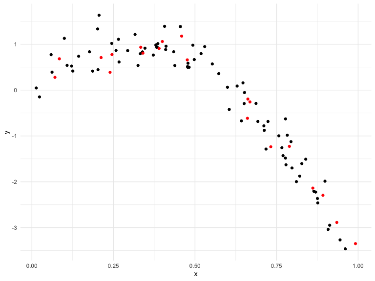
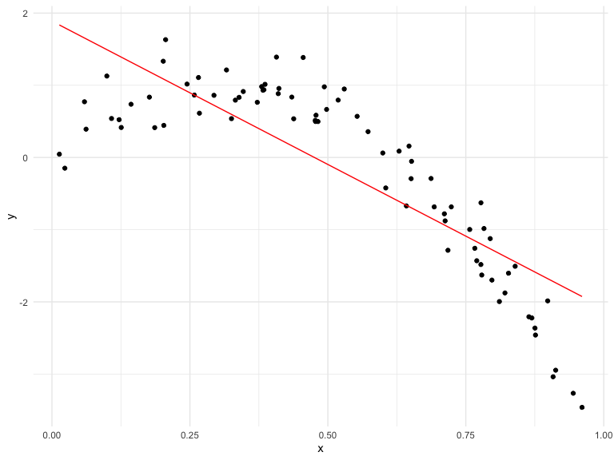

Cross Validation
================
Elaine Yanxi Chen
2022-12-03

## Packages and settings

First we load the packages necessary to knit this document.

``` r
library(tidyverse)
library(mgcv)
library(modelr)
library(viridis)

knitr::opts_chunk$set(
    echo = TRUE,
    warning = FALSE,
    fig.width = 8, 
  fig.height = 6,
  out.width = "90%"
)

theme_set(theme_minimal() + theme(legend.position = "bottom"))

options(
  ggplot2.continuous.colour = "viridis",
  ggplot2.continuous.fill = "viridis"
)

scale_colour_discrete = scale_colour_viridis_d
scale_fill_discrete = scale_fill_viridis_d

set.seed(1)
```

## Step one

Cross validation “by hand” on simulated data.

We first generate a non-linear model by hand.

``` r
nonlin_df = 
  tibble(
    id = 1:100,
    x = runif(100, 0, 1),
    y = 1 - 10 * (x - 0.3) ^ 2 + rnorm(100, 0, 0.3)
  )

nonlin_df %>% 
  ggplot(aes(x = x, y = y)) +
  geom_point()
```


Let’s get this by hand.Split the data into training and test sets using
`anti_join` and replot showing the split. We want to use the training
data in black to build candidate models, then see how these models
predict in the testing data in red.

``` r
train_df = sample_n(nonlin_df, 80)
test_df = anti_join(nonlin_df, train_df, by = "id")
```

``` r
train_df %>% 
  ggplot(aes(x = x, y = y)) +
  geom_point() +
  geom_point(data = test_df, colour = "red")
```



Let’s try to fit three models.

Using `mgcv::gam` for non-linear models, drawing smooth lines through
data clouds, and can control how smooth we want the fit to be.

``` r
linear_mod = lm(y ~ x, data = train_df)
smooth_mod = mgcv::gam(y ~ s(x), data = train_df)
wiggly_mod = mgcv::gam(y ~ s(x, k = 30), sp = 10e-6, data = train_df)
```

Let’s see the results.

``` r
train_df %>% 
  add_predictions(linear_mod) %>% 
  ggplot(aes(x = x, y = y)) +
  geom_point() +
  geom_line(aes(y = pred), colour = "red")
```



``` r
train_df %>% 
  add_predictions(smooth_mod) %>% 
  ggplot(aes(x = x, y = y)) +
  geom_point() +
  geom_line(aes(y = pred), colour = "red")
```


``` r
train_df %>% 
  add_predictions(wiggly_mod) %>% 
  ggplot(aes(x = x, y = y)) +
  geom_point() +
  geom_line(aes(y = pred), colour = "red")
```


Add predictions with `modelr::gather_predictions` function for several
models to a dataframe and then pivot so that the result is tidy.

``` r
train_df %>% 
  gather_predictions(linear_mod, smooth_mod, wiggly_mod) %>% 
  mutate(model = fct_inorder(model)) %>% 
  ggplot(aes(x = x, y = y)) +
  geom_point() +
  geom_line(aes(y = pred), colour = "red") +
  facet_wrap(~ model)
```


Linear model is too simple and will never capture the true relationship
between variables no matter what trianing data we use, standard smooth
fit is pretty good, wiggly fit is too complex, chasing datapoints, vary
a lot from one training dataset to the next, consistently wrong due to
its complexity, highly variable

Let’s make predictions and compute RMSEs.

``` r
test_df %>% add_predictions(linear_mod)
```

    ## # A tibble: 20 × 4
    ##       id      x      y     pred
    ##    <int>  <dbl>  <dbl>    <dbl>
    ##  1     8 0.661  -0.615 -0.735  
    ##  2    18 0.992  -3.35  -2.05   
    ##  3    21 0.935  -2.89  -1.82   
    ##  4    22 0.212   0.710  1.05   
    ##  5    30 0.340   0.807  0.537  
    ##  6    36 0.668  -0.258 -0.766  
    ##  7    46 0.789  -1.23  -1.25   
    ##  8    49 0.732  -1.24  -1.02   
    ##  9    52 0.861  -2.14  -1.53   
    ## 10    55 0.0707  0.278  1.61   
    ## 11    59 0.662  -0.195 -0.740  
    ## 12    63 0.459   1.18   0.0659 
    ## 13    69 0.0842  0.683  1.55   
    ## 14    74 0.334   0.935  0.563  
    ## 15    75 0.476   0.659 -0.00274
    ## 16    76 0.892  -2.29  -1.65   
    ## 17    78 0.390   0.908  0.340  
    ## 18    83 0.400   1.06   0.300  
    ## 19    89 0.245   0.775  0.914  
    ## 20    91 0.240   0.389  0.937

``` r
rmse(linear_mod, test_df)
```

    ## [1] 0.7052956

``` r
rmse(smooth_mod, test_df)
```

    ## [1] 0.2221774

``` r
rmse(wiggly_mod, test_df)
```

    ## [1] 0.289051

## Can we iterate…?

We needed to convert output from `crossv_mc` to a tibble because it is
not compatible with `gam`. If all we want is models from `lm` fit then
this step can be skipped.

Here, we are fitting each training dataset through the three models:
linear, smooth, and wiggly.And then we will obtain the RMSEs by fitting
each of the model through the testing dataset.

``` r
cv_df = 
  crossv_mc(nonlin_df, 100)

cv_df %>% pull(train) %>% .[[1]] %>% as_tibble()
```

    ## # A tibble: 79 × 3
    ##       id      x       y
    ##    <int>  <dbl>   <dbl>
    ##  1     1 0.266   1.11  
    ##  2     2 0.372   0.764 
    ##  3     3 0.573   0.358 
    ##  4     4 0.908  -3.04  
    ##  5     6 0.898  -1.99  
    ##  6     7 0.945  -3.27  
    ##  7     8 0.661  -0.615 
    ##  8     9 0.629   0.0878
    ##  9    10 0.0618  0.392 
    ## 10    11 0.206   1.63  
    ## # … with 69 more rows

``` r
cv_df = 
  crossv_mc(nonlin_df, 100) %>% 
  mutate(
    train = map(train, as_tibble),
    test = map(test, as_tibble),
  ) %>% 
  mutate(
    linear_fits = map(.x = train, ~lm(y ~ x, data = .x)),
    smooth_fits = map(.x = train, ~mgcv::gam(y ~ s(x), data = .x)),
    wiggly_fits = map(.x = train, ~mgcv::gam(y ~ s(x, k = 30), sp = 10e-6, data = .x))
  ) %>% 
  mutate(
    rmse_linear = map2_dbl(linear_fits, test, ~rmse(model = .x, data = .y)),
    rmse_smooth = map2_dbl(smooth_fits, test, ~rmse(model = .x, data = .y)),
    rmse_wiggly = map2_dbl(wiggly_fits, test, ~rmse(model = .x, data = .y)),
  )
```

Make a box plot… Compare these models using the RMSE.

``` r
cv_df %>% 
  select(starts_with("rmse")) %>% 
  pivot_longer(
    everything(),
    names_to = "model",
    values_to = "rmse",
    names_prefix = "rmse_"
  ) %>% 
  ggplot(aes(x = model, y = rmse)) +
  geom_boxplot()
```


## Try it on a real dataset

``` r
growth_df = read_csv("data/nepalese_children.csv")
```

    ## Rows: 2705 Columns: 5
    ## ── Column specification ────────────────────────────────────────────────────────
    ## Delimiter: ","
    ## dbl (5): age, sex, weight, height, armc
    ## 
    ## ℹ Use `spec()` to retrieve the full column specification for this data.
    ## ℹ Specify the column types or set `show_col_types = FALSE` to quiet this message.

``` r
growth_df %>% 
  ggplot(aes(x = weight, y = armc)) +
  geom_point(alpha = 0.3)
```


The plot suggest some non-linearity, especially at the low end of the
weight distribution. The three models we will try here are the linear
fit, a piecewise linear fit, and a smooth fit using `gam`.

Brief aside on piecewise linear models.

Here we add a “change point term” to the dataframe.

``` r
child_growth =
  growth_df %>% 
  mutate(
    weight_pwl = (weight > 7) * (weight - 7)
  )
```

``` r
linear_model = lm(armc ~ weight, data = child_growth)
pwl_model = lm(armc ~ weight + weight_pwl, data = child_growth)
smooth_model = mgcv::gam(armc ~ s(weight), data = child_growth)
```

Plotting the three models for an intuition for goodness of fit.

``` r
child_growth %>% 
  gather_predictions(linear_model, pwl_model, smooth_model) %>% 
  mutate(model = fct_inorder(model)) %>% 
  ggplot(aes(x = weight, y = armc)) + 
  geom_point(alpha = .5) +
  geom_line(aes(y = pred), colour = "red") + 
  facet_grid(~model)
```


``` r
child_growth %>% 
  add_predictions(pwl_model) %>% 
  ggplot(aes(x = weight, y = armc)) +
  geom_point(alpha = 0.3) +
  geom_line(aes(y = pred), colour = "red")
```


``` r
child_growth %>% 
  add_predictions(linear_model) %>% 
  ggplot(aes(x = weight, y = armc)) +
  geom_point(alpha = 0.3) +
  geom_line(aes(y = pred), colour = "red")
```


``` r
child_growth %>% 
  add_predictions(smooth_model) %>% 
  ggplot(aes(x = weight, y = armc)) +
  geom_point(alpha = 0.3) +
  geom_line(aes(y = pred), colour = "red")
```


``` r
cv_df = 
  crossv_mc(child_growth, 100) %>% 
  mutate(
    train = map(train, as_tibble),
    test = map(test, as_tibble),
  )

cv_df = 
  cv_df %>% 
  mutate(
    linear_fits = map(.x = train, ~lm(armc ~ weight, data = .x)),
    pwl_fits =    map(.x = train, ~lm(armc ~ weight + weight_pwl, data = .x)),
    smooth_fits = map(.x = train, ~mgcv::gam(armc ~ s(weight), data = .x))
  ) %>% 
  mutate(
    rmse_linear = map2_dbl(.x = linear_fits, .y = test, ~rmse(model = .x, data = .y)),
    rmse_pwl =    map2_dbl(.x = pwl_fits, .y = test, ~rmse(model = .x, data = .y)),
    rmse_smooth = map2_dbl(.x = smooth_fits, .y = test, ~rmse(model = .x, data = .y))
  )
```

Let’s look at the results…

``` r
cv_df %>% 
  select(starts_with("rmse")) %>% 
  pivot_longer(
    everything(),
    names_to = "model",
    values_to = "rmse",
    names_prefix = "rmse_"
  ) %>% 
  ggplot(aes(x = model, y = rmse)) +
  geom_boxplot()
```


``` r
cv_df %>% 
  select(starts_with("rmse")) %>% 
  pivot_longer(
    everything(),
    names_to = "model",
    values_to = "rmse",
    names_prefix = "rmse_"
  ) %>% 
  ggplot(aes(x = model, y = rmse)) +
  geom_violin()
```


