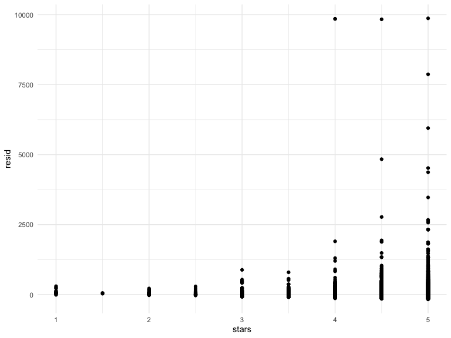
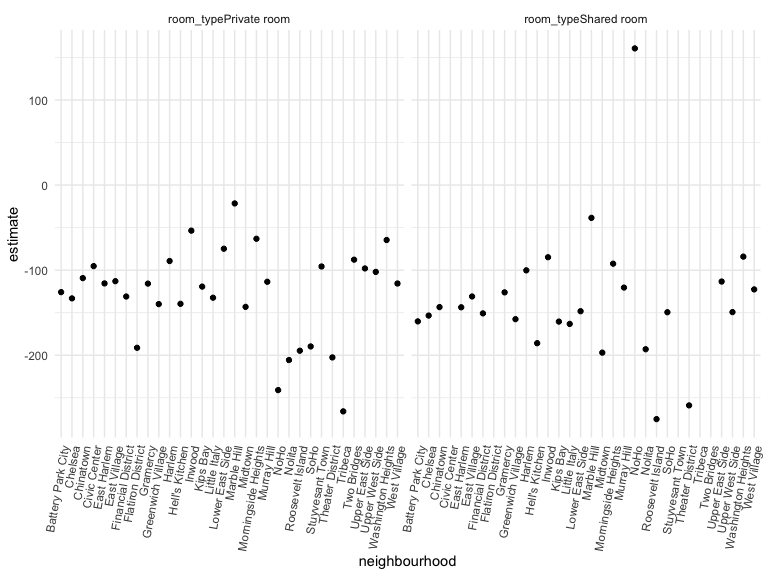

Linear Models
================
Elaine Yanxi Chen
2022-12-03

## Packages and settings

First we load the packages necessary to knit this document.

``` r
library(tidyverse)
library(p8105.datasets)
library(viridis)

knitr::opts_chunk$set(
    echo = TRUE,
    warning = FALSE,
    fig.width = 8, 
  fig.height = 6,
  out.width = "90%"
)

theme_set(theme_minimal() + theme(legend.position = "bottom"))

options(
  ggplot2.continuous.colour = "viridis",
  ggplot2.continuous.fill = "viridis"
)

scale_colour_discrete = scale_colour_viridis_d
scale_fill_discrete = scale_fill_viridis_d
```

Load NYC Airbnb data.

``` r
data("nyc_airbnb")

nyc_airbnb =
  nyc_airbnb %>% 
  mutate(stars = review_scores_location / 2) %>% 
  rename(
    borough = neighbourhood_group
  ) %>% 
  filter(borough != "Staten Island") %>% 
  select(price, stars, borough, neighbourhood, room_type)
```

# Fit the first model

``` r
fit = lm(price ~ stars + borough, data = nyc_airbnb)

fit
```

    ## 
    ## Call:
    ## lm(formula = price ~ stars + borough, data = nyc_airbnb)
    ## 
    ## Coefficients:
    ##      (Intercept)             stars   boroughBrooklyn  boroughManhattan  
    ##           -70.41             31.99             40.50             90.25  
    ##    boroughQueens  
    ##            13.21

``` r
summary(fit)
```

    ## 
    ## Call:
    ## lm(formula = price ~ stars + borough, data = nyc_airbnb)
    ## 
    ## Residuals:
    ##    Min     1Q Median     3Q    Max 
    ## -169.8  -64.0  -29.0   20.2 9870.0 
    ## 
    ## Coefficients:
    ##                  Estimate Std. Error t value Pr(>|t|)    
    ## (Intercept)       -70.414     14.021  -5.022 5.14e-07 ***
    ## stars              31.990      2.527  12.657  < 2e-16 ***
    ## boroughBrooklyn    40.500      8.559   4.732 2.23e-06 ***
    ## boroughManhattan   90.254      8.567  10.534  < 2e-16 ***
    ## boroughQueens      13.206      9.065   1.457    0.145    
    ## ---
    ## Signif. codes:  0 '***' 0.001 '**' 0.01 '*' 0.05 '.' 0.1 ' ' 1
    ## 
    ## Residual standard error: 181.5 on 30525 degrees of freedom
    ##   (9962 observations deleted due to missingness)
    ## Multiple R-squared:  0.03423,    Adjusted R-squared:  0.03411 
    ## F-statistic: 270.5 on 4 and 30525 DF,  p-value: < 2.2e-16

``` r
summary(fit)$coef
```

    ##                   Estimate Std. Error   t value     Pr(>|t|)
    ## (Intercept)      -70.41446  14.020697 -5.022180 5.137589e-07
    ## stars             31.98989   2.527500 12.656733 1.269392e-36
    ## boroughBrooklyn   40.50030   8.558724  4.732049 2.232595e-06
    ## boroughManhattan  90.25393   8.567490 10.534465 6.638618e-26
    ## boroughQueens     13.20617   9.064879  1.456850 1.451682e-01

``` r
fit %>% 
  broom::tidy() %>% 
  mutate(
    term = str_replace(term, "borough", "Borough: ")
  ) %>% 
  select(term, estimate, p.value) %>% 
  knitr::kable(digits = 2)
```

| term               | estimate | p.value |
|:-------------------|---------:|--------:|
| (Intercept)        |   -70.41 |    0.00 |
| stars              |    31.99 |    0.00 |
| Borough: Brooklyn  |    40.50 |    0.00 |
| Borough: Manhattan |    90.25 |    0.00 |
| Borough: Queens    |    13.21 |    0.15 |

``` r
fit %>% 
  broom::glance() %>% 
  select(AIC)
```

    ## # A tibble: 1 × 1
    ##       AIC
    ##     <dbl>
    ## 1 404237.

Let’s change the reference category.

``` r
fit2 =  
  nyc_airbnb %>% 
  mutate(
    borough = fct_infreq(borough)
  ) %>% 
  lm(price ~ stars + borough, data = .) 

fit2 %>% 
  broom::tidy() %>% 
  mutate(
    term = str_replace(term, "borough", "Borough: ")
  ) %>% 
  select(term, estimate, p.value) %>% 
  knitr::kable(digits = 2)
```

| term              | estimate | p.value |
|:------------------|---------:|--------:|
| (Intercept)       |    19.84 |     0.1 |
| stars             |    31.99 |     0.0 |
| Borough: Brooklyn |   -49.75 |     0.0 |
| Borough: Queens   |   -77.05 |     0.0 |
| Borough: Bronx    |   -90.25 |     0.0 |

## Diagnostics

``` r
modelr::add_residuals(nyc_airbnb, fit) %>% 
  ggplot(aes(x = stars, y = resid)) +
  geom_point()
```



Could also add predictions.

``` r
modelr::add_predictions(nyc_airbnb, fit)
```

    ## # A tibble: 40,492 × 6
    ##    price stars borough neighbourhood room_type        pred
    ##    <dbl> <dbl> <chr>   <chr>         <chr>           <dbl>
    ##  1    99   5   Bronx   City Island   Private room     89.5
    ##  2   200  NA   Bronx   City Island   Private room     NA  
    ##  3   300  NA   Bronx   City Island   Entire home/apt  NA  
    ##  4   125   5   Bronx   City Island   Entire home/apt  89.5
    ##  5    69   5   Bronx   City Island   Private room     89.5
    ##  6   125   5   Bronx   City Island   Entire home/apt  89.5
    ##  7    85   5   Bronx   City Island   Entire home/apt  89.5
    ##  8    39   4.5 Bronx   Allerton      Private room     73.5
    ##  9    95   5   Bronx   Allerton      Entire home/apt  89.5
    ## 10   125   4.5 Bronx   Allerton      Entire home/apt  73.5
    ## # … with 40,482 more rows

Is there constant variance? No, constant variance assumption is not
satisfied here. Doesn’t mean our regression is invalid, but need to
worry about this if doing hypotheses testing, or want to exclude
outliers.

``` r
nyc_airbnb %>% 
  modelr::add_residuals(fit) %>% 
  ggplot(aes(x = borough, y = resid)) +
  geom_violin() +
  ylim(-250, 250)
```


Assumptions are not met here, but sample size is big.

## Hypothesis testing

one coefficient (let’s say `stars`).

Testing using nested models. Below only works for nested models and
comparing non-nested models is different and requires other methods.

``` r
fit %>% 
  broom::tidy()
```

    ## # A tibble: 5 × 5
    ##   term             estimate std.error statistic  p.value
    ##   <chr>               <dbl>     <dbl>     <dbl>    <dbl>
    ## 1 (Intercept)         -70.4     14.0      -5.02 5.14e- 7
    ## 2 stars                32.0      2.53     12.7  1.27e-36
    ## 3 boroughBrooklyn      40.5      8.56      4.73 2.23e- 6
    ## 4 boroughManhattan     90.3      8.57     10.5  6.64e-26
    ## 5 boroughQueens        13.2      9.06      1.46 1.45e- 1

``` r
fit_null = lm(price ~ stars, data = nyc_airbnb)
fit_alt = lm(price ~ stars + borough, data = nyc_airbnb)

anova(fit_null, fit_alt) %>% 
  broom::tidy()
```

    ## # A tibble: 2 × 7
    ##   term                    df.residual       rss    df   sumsq stati…¹    p.value
    ##   <chr>                         <dbl>     <dbl> <dbl>   <dbl>   <dbl>      <dbl>
    ## 1 price ~ stars                 30528    1.03e9    NA NA          NA  NA        
    ## 2 price ~ stars + borough       30525    1.01e9     3  2.53e7    256.  7.84e-164
    ## # … with abbreviated variable name ¹​statistic

## Room type by borough

Interactions…?

``` r
fit = 
  nyc_airbnb %>% 
  lm(price ~ stars + borough * room_type, data = .)

fit %>% 
  broom::tidy()
```

    ## # A tibble: 13 × 5
    ##    term                                   estimate std.error statistic  p.value
    ##    <chr>                                     <dbl>     <dbl>     <dbl>    <dbl>
    ##  1 (Intercept)                                13.1     18.3      0.718 4.73e- 1
    ##  2 stars                                      21.8      2.42     8.97  3.06e-19
    ##  3 boroughBrooklyn                            52.8     14.9      3.54  4.07e- 4
    ##  4 boroughManhattan                          108.      14.9      7.27  3.78e-13
    ##  5 boroughQueens                              21.7     15.7      1.38  1.67e- 1
    ##  6 room_typePrivate room                     -53.0     17.8     -2.99  2.82e- 3
    ##  7 room_typeShared room                      -68.5     41.5     -1.65  9.91e- 2
    ##  8 boroughBrooklyn:room_typePrivate room     -39.2     18.0     -2.17  2.98e- 2
    ##  9 boroughManhattan:room_typePrivate room    -71.6     18.0     -3.98  7.03e- 5
    ## 10 boroughQueens:room_typePrivate room       -15.6     19.0     -0.820 4.12e- 1
    ## 11 boroughBrooklyn:room_typeShared room      -37.3     42.9     -0.869 3.85e- 1
    ## 12 boroughManhattan:room_typeShared room     -85.4     42.4     -2.01  4.41e- 2
    ## 13 boroughQueens:room_typeShared room        -24.6     44.3     -0.555 5.79e- 1

If testing, need to build interactions; for exploratory analyses, could
do separate lines for different boroughs.

So…can we fit models by borough…?

Using the `nest` function, we could split up the data by boroughs.

Use `nest` to create a list column containing datasets and fit separate
models to each.

This approach is kind of an alternative to interactions, since we have
to really think through the interpretation for interactions.

``` r
nest_lm_res =
  nyc_airbnb %>% 
  nest(df = -borough) %>% 
  mutate(
    models = map(.x = df, ~lm(price ~ stars + room_type, data = .x)),
    results = map(models, broom::tidy)
  ) %>% 
  select(borough, results) %>% 
  unnest(results)
```

We can show the results of the above approach as such.

``` r
nest_lm_res %>% 
  select(borough, term, estimate) %>% 
  mutate(term = fct_inorder(term)) %>% 
  pivot_wider(
    names_from = term, values_from = estimate) %>% 
  knitr::kable(digits = 3)
```

| borough   | (Intercept) |  stars | room_typePrivate room | room_typeShared room |
|:----------|------------:|-------:|----------------------:|---------------------:|
| Bronx     |      90.067 |  4.446 |               -52.915 |              -70.547 |
| Queens    |      91.575 |  9.654 |               -69.255 |              -94.973 |
| Brooklyn  |      69.627 | 20.971 |               -92.223 |             -105.839 |
| Manhattan |      95.694 | 27.110 |              -124.188 |             -153.635 |

These have a tradeoff: stratified models make it easy to interpret
covariate effects in each stratum, but don’t provide a mechanism for
assessing the significance of differences across strata.

Quick double check…?

``` r
nyc_airbnb %>% 
  filter(borough == "Bronx") %>% 
  lm(price ~ stars + room_type, data = .) %>% 
  broom::tidy()
```

    ## # A tibble: 4 × 5
    ##   term                  estimate std.error statistic  p.value
    ##   <chr>                    <dbl>     <dbl>     <dbl>    <dbl>
    ## 1 (Intercept)              90.1      15.2       5.94 5.73e- 9
    ## 2 stars                     4.45      3.35      1.33 1.85e- 1
    ## 3 room_typePrivate room   -52.9       3.57    -14.8  6.21e-41
    ## 4 room_typeShared room    -70.5       8.36     -8.44 4.16e-16

Can just change what we filter for if we are only interested in one
boroughs. But the earlier approach is much easier to get results for all
boroughs without repeating the same procedures 4 times.

More extreme example from the course website, assessing neighbourhood
effects in Manhattan.

``` r
manhattan_airbnb =
  nyc_airbnb %>% 
  filter(borough == "Manhattan")

manhattan_nest_lm_res =
  manhattan_airbnb %>% 
  nest(data = -neighbourhood) %>% 
  mutate(
    models = map(data, ~lm(price ~ stars + room_type, data = .x)),
    results = map(models, broom::tidy)) %>% 
  select(-data, -models) %>% 
  unnest(results)
```

``` r
manhattan_nest_lm_res %>% 
  filter(str_detect(term, "room_type")) %>% 
  ggplot(aes(x = neighbourhood, y = estimate)) + 
  geom_point() + 
  facet_wrap(~term) + 
  theme(axis.text.x = element_text(angle = 80, hjust = 1))
```



Here it’s a better idea to use random intercepts and slopes for each
neighbourhood. This is a mixed model approach.

``` r
manhattan_airbnb %>% 
  lme4::lmer(price ~ stars + room_type + (1 + room_type | neighbourhood), data = .) %>% 
  broom.mixed::tidy()
```

## Binary outcomes and logistic regression

``` r
baltimore_df = 
  read_csv("data/homicide-data.csv") %>% 
  filter(city == "Baltimore") %>% 
  mutate(
    resolved = as.numeric(disposition == "Closed by arrest"),
    victim_age = as.numeric(victim_age),
    victim_race = fct_relevel(victim_race, "White")) %>% 
  select(resolved, victim_age, victim_race, victim_sex)
```

    ## Rows: 52179 Columns: 12
    ## ── Column specification ────────────────────────────────────────────────────────
    ## Delimiter: ","
    ## chr (9): uid, victim_last, victim_first, victim_race, victim_age, victim_sex...
    ## dbl (3): reported_date, lat, lon
    ## 
    ## ℹ Use `spec()` to retrieve the full column specification for this data.
    ## ℹ Specify the column types or set `show_col_types = FALSE` to quiet this message.

Interesting and much better way to assign resolved status here.

Using logistic regression, could fit logistic regression for binary
“resolved” outcome.

``` r
fit_logistic = 
  baltimore_df %>% 
  glm(resolved ~ victim_age + victim_race + victim_sex, data = ., family = binomial()) 
```

``` r
fit_logistic %>% 
  broom::tidy() %>% 
  mutate(OR = exp(estimate)) %>%
  select(term, log_OR = estimate, OR, p.value) %>% 
  knitr::kable(digits = 3)
```

| term                | log_OR |    OR | p.value |
|:--------------------|-------:|------:|--------:|
| (Intercept)         |  1.190 | 3.287 |   0.000 |
| victim_age          | -0.007 | 0.993 |   0.027 |
| victim_raceAsian    |  0.296 | 1.345 |   0.653 |
| victim_raceBlack    | -0.842 | 0.431 |   0.000 |
| victim_raceHispanic | -0.265 | 0.767 |   0.402 |
| victim_raceOther    | -0.768 | 0.464 |   0.385 |
| victim_sexMale      | -0.880 | 0.415 |   0.000 |

Transform log odds to probabilities for each subject.

``` r
baltimore_df %>% 
  modelr::add_predictions(fit_logistic) %>% 
  mutate(fitted_prob = boot::inv.logit(pred))
```

    ## # A tibble: 2,827 × 6
    ##    resolved victim_age victim_race victim_sex    pred fitted_prob
    ##       <dbl>      <dbl> <fct>       <chr>        <dbl>       <dbl>
    ##  1        0         17 Black       Male       -0.654        0.342
    ##  2        0         26 Black       Male       -0.720        0.327
    ##  3        0         21 Black       Male       -0.683        0.335
    ##  4        1         61 White       Male       -0.131        0.467
    ##  5        1         46 Black       Male       -0.864        0.296
    ##  6        1         27 Black       Male       -0.727        0.326
    ##  7        1         21 Black       Male       -0.683        0.335
    ##  8        1         16 Black       Male       -0.647        0.344
    ##  9        1         21 Black       Male       -0.683        0.335
    ## 10        1         44 Black       Female      0.0297       0.507
    ## # … with 2,817 more rows
